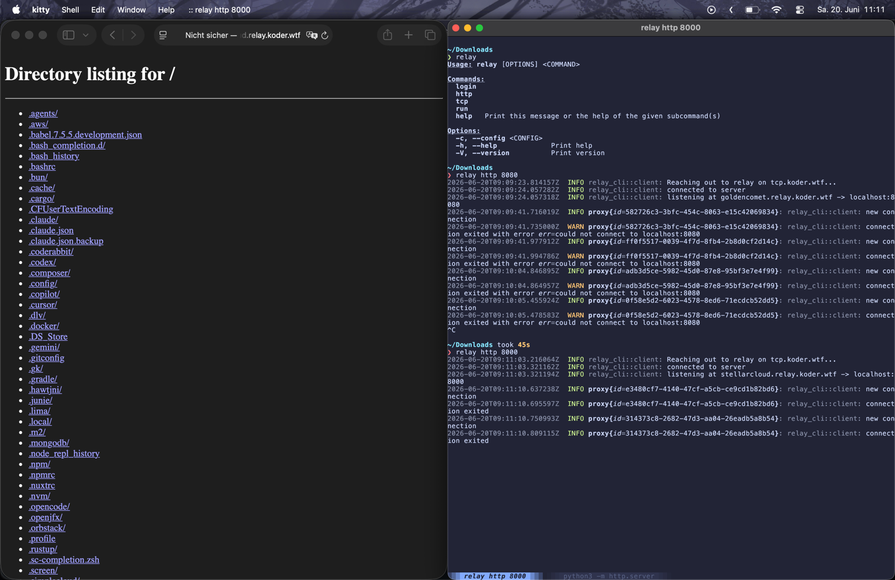

# Relay



Relay is a TCP tunneling service. Unlike many other services on the market, it is open-source and free to use (with some limitations, of course).

We also plan to offer unique features, such as persistent domains, so your friends won't have to update the URL every time they want to visit your site.

---
## Table of Contents

- [Installation](#installation)
  - [macOS / Linux](#macos--linux)
  - [Windows](#windows)
  - [Build from source](#build-from-source)
- [Usage](#usage)
  - [Login](#login)
  - [Expose an HTTP service](#expose-an-http-service)
  - [Expose a TCP service](#expose-a-tcp-service)
  - [Run from a config file](#run-from-a-config-file)
- [Credits](#credits)

---

## Installation

### macOS / Linux

Run the one-liner installer. It downloads the correct binary for your OS and architecture and places it in `/usr/local/bin`:

```sh
curl -fsSL https://raw.githubusercontent.com/InvalidJoker/relay/main/install.sh | sh
```

To install a specific version:

```sh
RELAY_VERSION=v0.1.0 curl -fsSL https://raw.githubusercontent.com/InvalidJoker/relay/main/install.sh | sh
```

To install to a custom directory:

```sh
RELAY_INSTALL_DIR=~/.local/bin curl -fsSL https://raw.githubusercontent.com/InvalidJoker/relay/main/install.sh | sh
```

### Windows

Open PowerShell and run:

```powershell
irm https://raw.githubusercontent.com/InvalidJoker/relay/main/install.ps1 | iex
```

The binary is installed to `%LOCALAPPDATA%\relay\bin` and added to your user `PATH` automatically.

To install a specific version:

```powershell
irm https://raw.githubusercontent.com/InvalidJoker/relay/main/install.ps1 | iex -Version v0.1.0
```

### Build from source

Requires [Rust](https://rustup.rs/) (edition 2024 / stable toolchain):

```sh
git clone https://github.com/InvalidJoker/relay.git
cd relay
cargo build --release -p relay_cli
# binary is at target/release/relay
```

---

## Usage

### Login

Before using Relay you need to authenticate with the server. This uses the OAuth 2.0 Device Code flow — no browser redirect required:

```sh
relay login
```

You will be shown a short code and a URL. Open the URL, enter the code, and the CLI will save your credentials automatically to `~/.config/relay.toml`.

To log in against a self-hosted server:

```sh
relay login https://your-relay-server.example.com
```
---

### Expose an HTTP service

Forward a local HTTP server on port `3000` to a public URL:

```sh
relay http 3000
```

Pick a custom subdomain (if available):

```sh
relay http 3000 --subdomain myapp
```

Protect the tunnel with basic auth:

```sh
relay http 3000 --username alice --password secret
```

Save the config so you can restart it later with `relay run`:

```sh
relay http 3000 --subdomain myapp --save
```
---

### Expose a TCP service

Forward a local TCP port (e.g. a game server on port `25565`):

```sh
relay tcp 25565
```

Request a specific remote port:

```sh
relay tcp 25565 8080
```

Save the config:

```sh
relay tcp 25565 --save
```
---

### Run from a config file

If you saved a config with `--save`, restart the tunnel without repeating all flags:

```sh
relay run
```

Use a custom config path:

```sh
relay run --path /path/to/relay.toml
```

A `relay.toml` file looks like this:

```toml
# HTTP example
relay_type = "Http"
port = 3000
domain = "myapp"

# TCP example
# relay_type = "Tcp"
# port = 25565
# remote_port = 8080
```

---

## Credits

- [Bore](https://github.com/ekzhang/bore/blob/main/src/main.rs) — Huge thanks to Bore for providing a great example of how to build a TCP tunneling service. A lot of inspiration was taken from their codebase; highly recommended if you're interested in building something similar.
